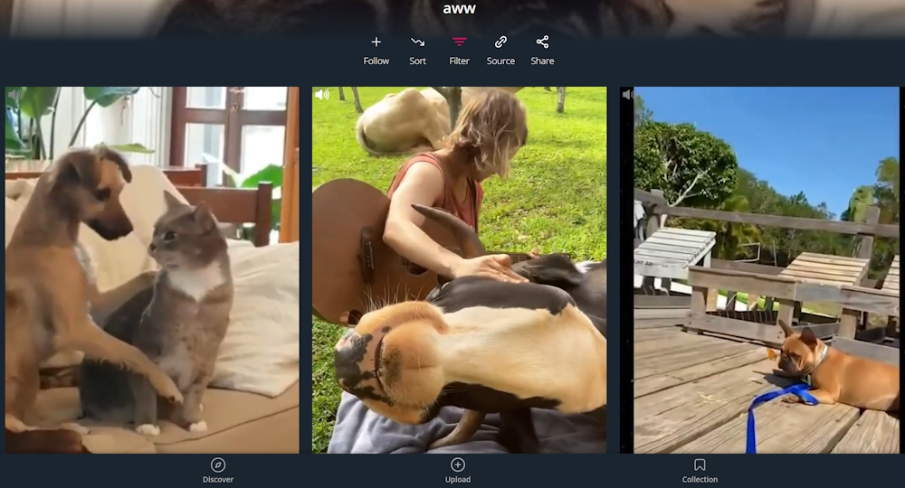

# Scrolller.com Autoplay Feed
Tampermonkey Userscript Enabling Autoplay Videos in Feed on [Scrolller.com](https://scrolller.com)

Autoplay was enabled by default in the past but moved now into the premium plan. This userscript brings it back.

## Installation
[Install on Greasyfork](https://greasyfork.org/scripts/482059)

Recommended: [Scrolller.com Adblocker](https://greasyfork.org/de/scripts/465664)

## Usage
Click on the gray audio icon above a video to activate the audio globally. The sound changes from video to video as you scroll.
 
Click on the grey audio icon above a specific video to play the audio of the specific video.
 
Click on the white audio icon above a video, to disable global audio again.

